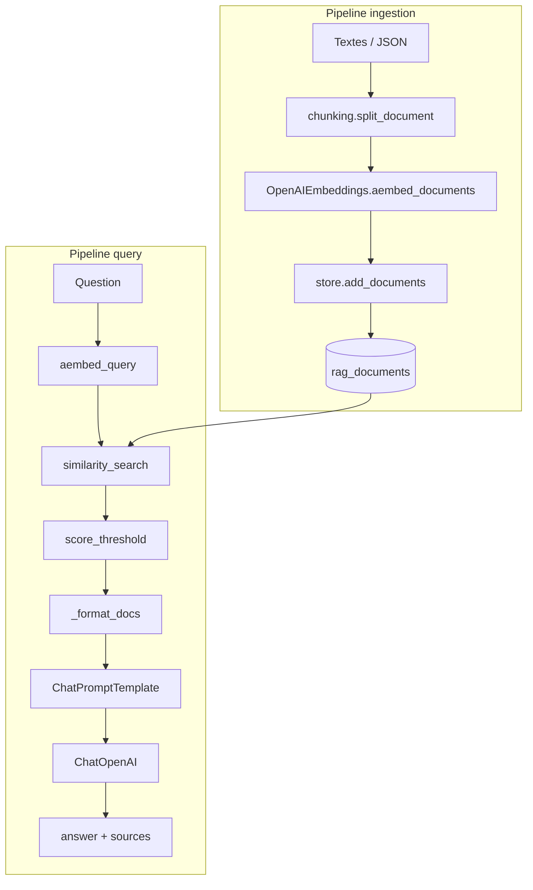

# RAG – Recherche vectorielle (expert)

## Stack (compatible Railway sans pgvector)

- **Postgres** : table `rag_documents` avec `content` (text), `metadata` (JSONB), `embedding` (JSONB, liste de floats). Pas d’extension pgvector : la similarité est calculée en Python.
- **Recherche** : similarité **cosine** en Python sur les embeddings. Formule : `similarité = dot(a,b) / (||a|| * ||b||)` ; **distance = 1 - similarité**. Plus la distance est faible, plus le chunk est pertinent.
- **LangChain** : `langchain-core`, `langchain-openai`, `langchain-text-splitters` (chunking). Composants : OpenAIEmbeddings, BaseRetriever, ChatPromptTemplate, ChatOpenAI, StrOutputParser.
- **Embeddings** : OpenAI `text-embedding-3-small` (1536 dimensions).

---

## Architecture et pipelines

### Pipeline d’ingestion

1. Charger les documents sources (fichiers JSON dans `backend/data/`).
2. Optionnel : découper les textes longs avec **chunking.split_document** (RecursiveCharacterTextSplitter, chunk_size 700, overlap 100).
3. **store.add_documents** : embed des chunks via OpenAIEmbeddings, insertion en base (content, metadata, embedding).
4. Répéter l’ingestion quand le corpus change (script ou POST /rag/ingest).

### Pipeline de requête

1. **Embed** de la question (OpenAIEmbeddings.aembed_query).
2. **store.similarity_search** : récupère les documents (éventuellement filtrés par metadata), calcule la distance cosine pour chaque document, trie, retourne les k plus proches avec **score = 1 - distance**.
3. **Retriever** : filtre optionnel par **score_threshold** (ne garder que les chunks avec score >= seuil).
4. **chain._format_docs** : concatène les page_content des documents en un seul bloc.
5. **ChatPromptTemplate** : system prompt (ex. expert « agents IA ») + contexte + question.
6. **ChatOpenAI** : génère la réponse.
7. Retour : **answer** + **sources** (content, metadata, score) pour que le prof puisse challenger.



---

## Data vectorisée (pour le prof)

### Fichiers du corpus (avant ingestion)

- **backend/data/rag_sample.json** : documents PraxIA (plateforme, recipes, coûts, RAG, API).
- **backend/data/rag_agents_ia.json** : corpus expert « agents IA » (40+ chunks) : définitions, patterns ReAct/RAG/tool use, bonnes pratiques, LangChain, évaluation.

### Procédure pour challenger les réponses

1. **Ingestion** (une fois) : exécuter le script d’ingestion ou **POST /rag/ingest** avec le body de chaque fichier JSON.
2. **Test du chatbot** : **POST /rag/query** (ou l’UI « Agent IA ») avec une question ; la réponse contient **answer** et **sources** (chaque source a **score** = similarité).
3. **Export** : **GET /rag/data** renvoie tous les documents en base (id, content, metadata, created_at). Optionnel : `?include_embeddings=true` pour recalculer la similarité cosine côté client. Optionnel : `?source=agents_ia` pour ne récupérer que la collection agents_ia.

En comparant les **sources** retournées (et leur **score**) à la question posée, le prof peut vérifier que les chunks les plus pertinents sont bien utilisés et challenger les réponses.

---

## Démo – Commandes

### Ingestion

```bash
# Backend démarré + migration 008 appliquée
uv run python -m scripts.ingest_rag_sample    # PraxIA uniquement
uv run python -m scripts.ingest_rag            # PraxIA + agents_ia (corpus complet)
```

Ou en HTTP : **POST /rag/ingest** avec le body de `data/rag_sample.json` ou `data/rag_agents_ia.json`.

### Requête

**POST /rag/query**  
Body :  
`{ "question": "Qu'est-ce que le pattern ReAct ?", "k": 6, "specialist": "agents_ia", "score_threshold": 0.65 }`  
Réponse : `{ "answer": "...", "sources": [ { "content": "...", "metadata": {...}, "score": 0.89 } ] }`.

### Export

**GET /rag/data**  
**GET /rag/data?source=agents_ia**  
**GET /rag/data?include_embeddings=true**

---

## Fonctions Python (pour le prof – LangChain)

### app/rag/chunking.py

- **split_document(content, metadata, chunk_size=700, chunk_overlap=100)** : découpe un document (texte long) en chunks avec overlap via LangChain RecursiveCharacterTextSplitter. Retourne une liste de `(chunk_text, metadata)` pour alimenter **add_documents**. Rôle : pipeline d’ingestion quand les sources sont des textes longs.

### app/rag/store.py

- **add_documents(documents)** : reçoit une liste de `(content, metadata)`, vectorise les textes avec **OpenAIEmbeddings.aembed_documents**, insère chaque (content, metadata, embedding) dans la table **rag_documents**. Utilisé lors de l’ingestion.
- **similarity_search(query_embedding, k, filter_metadata=None)** : charge les lignes de rag_documents (éventuellement filtrées par `metadata @> filter_metadata`), calcule pour chaque ligne la **distance cosine** entre query_embedding et l’embedding du document, trie par distance, retourne les k premiers avec **content**, **metadata**, **distance**, **score** (1 - distance).
- **list_documents(filter_metadata=None, include_embeddings=False)** : export pour le prof ; retourne la liste des documents (id, content, metadata, created_at, optionnellement embedding).

### app/rag/retriever.py

- **PgVectorRetriever** : hérite de **BaseRetriever** (LangChain). Paramètres : k, score_threshold (optionnel), filter_metadata (optionnel).
- **_aget_relevant_documents(query)** : embed de la question via **OpenAIEmbeddings.aembed_query**, appel à **store.similarity_search** avec k et filter_metadata, puis filtrage des hits par **score_threshold** (ne garder que score >= seuil). Retourne une liste de **Document** (page_content, metadata dont distance et score). S’intègre dans une chaîne LCEL pour alimenter le contexte du prompt.

### app/rag/chain.py

- **_format_docs(docs)** : concatène les **page_content** des documents en un seul bloc (séparateur `---`). Utilisé pour construire le champ « contexte » du prompt.
- **create_rag_chain(k)** : construit une chaîne LCEL (retriever → format_docs → ChatPromptTemplate → ChatOpenAI → StrOutputParser). Utilisée pour une invocation générique.
- **query_rag(question, k, specialist, score_threshold, filter_metadata)** : orchestration complète : instancie le retriever avec les options, récupère les documents, formate le contexte, choisit le **system prompt** selon specialist (ex. expert « agents IA »), appelle le LLM, retourne **(réponse, sources avec score)**.

---

## Formule cosine

- **Similarité** : `sim(a, b) = (a · b) / (||a|| * ||b||)` (valeurs entre -1 et 1 ; 1 = identique).
- **Distance** (utilisée dans le code) : `distance = 1 - sim(a, b)`. Plus la distance est **faible**, plus le document est pertinent.
- **Score** retourné à l’utilisateur : `score = 1 - distance` = similarité. Plus le score est **élevé**, plus le chunk est pertinent.

---

## Performance

Pour une base de 100–500 chunks, charger tous les embeddings en RAM et calculer la similarité en Python est raisonnable. Pour une base > 500 chunks, envisager un index vectoriel (extension pgvector, ou FAISS) pour éviter de charger tous les embeddings.

---

## Railway

- Postgres : aucun extension requise (types UUID, text, jsonb).
- Dépendances RAG : langchain-core, langchain-openai, langchain-text-splitters.
